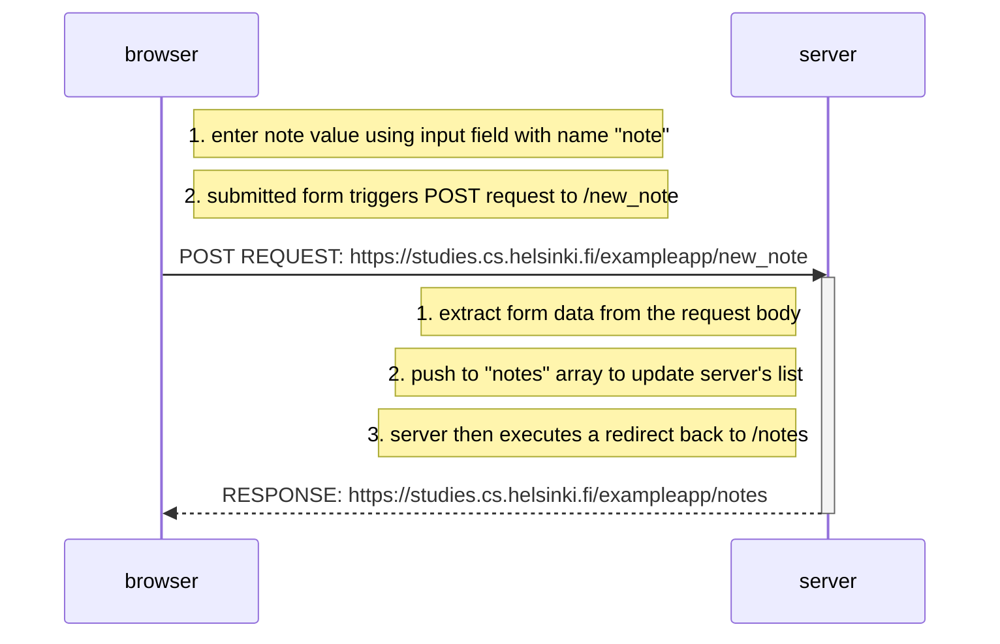

```mermaid
sequenceDiagram
  participant browser
  participant server

  Note right of browser: 1. enter note value using input field with name "note"

  Note right of browser: 2. submitted form triggers POST request to /new_note


  browser->>server: POST REQUEST: https://studies.cs.helsinki.fi/exampleapp/new_note

  activate server

  Note left of server: 1. extract form data from the request body

  Note left of server: 2. push to "notes" array to update server's list

  Note left of server: 3. server then executes a redirect back to /notes


  server-->>browser: RESPONSE: https://studies.cs.helsinki.fi/exampleapp/notes

  deactivate server


```
