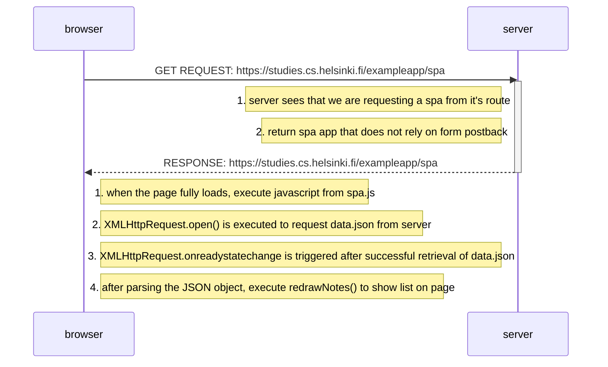

```mermaid
sequenceDiagram
  participant browser
  participant server

  browser->>server: GET REQUEST: https://studies.cs.helsinki.fi/exampleapp/spa

  activate server

  Note left of server: 1. server sees that we are requesting a spa from it's route

  Note left of server: 2. return spa app that does not rely on form postback

  server-->>browser: RESPONSE: https://studies.cs.helsinki.fi/exampleapp/spa

  deactivate server

  Note right of browser: 1. when the page fully loads, execute javascript from spa.js

  Note right of browser: 2. XMLHttpRequest.open() is executed to request data.json from server

  Note right of browser: 3. XMLHttpRequest.onreadystatechange is triggered after successful retrieval of data.json

  Note right of browser: 4. after parsing the JSON object, execute redrawNotes() to show list on page


```
