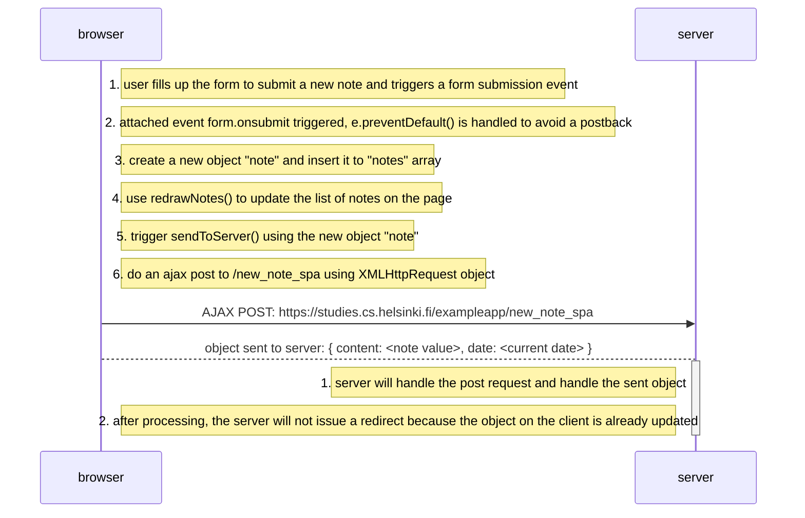

```mermaid
sequenceDiagram
  participant browser
  participant server

  Note right of browser: 1. user fills up the form to submit a new note and triggers a form submission event

  Note right of browser: 2. attached event form.onsubmit triggered, e.preventDefault() is handled to avoid a postback

  Note right of browser: 3. create a new object "note" and insert it to "notes" array

  Note right of browser: 4. use redrawNotes() to update the list of notes on the page

  Note right of browser: 5. trigger sendToServer() using the new object "note"

  Note right of browser: 6. do an ajax post to /new_note_spa using XMLHttpRequest object

  browser->>server: AJAX POST: https://studies.cs.helsinki.fi/exampleapp/new_note_spa

  browser-->server: object sent to server: { content: <note value>, date: <current date> }


  activate server

  Note left of server: 1. server will handle the post request and handle the sent object

  Note left of server: 2. after processing, the server will not issue a redirect because the object on the client is already updated

  deactivate server


```
